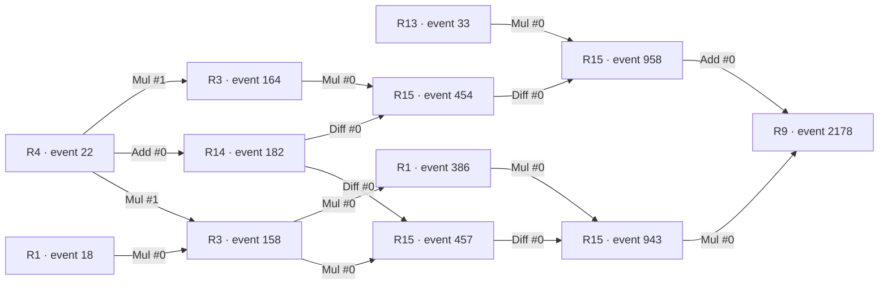

# 一个深度 4 的共享依赖窗口

箭头表示 producer → consumer；同一事件只画一次。

```mermaid
graph LR
  n0["R9 · event 2178"]
  n1["R15 · event 958"]
  n2["R15 · event 943"]
  n3["R13 · event 33"]
  n4["R15 · event 454"]
  n5["R1 · event 386"]
  n6["R15 · event 457"]
  n7["R3 · event 164"]
  n8["R14 · event 182"]
  n9["R3 · event 158"]
  n10["R4 · event 22"]
  n11["R1 · event 18"]
  n1 -->|"Add #0"| n0
  n2 -->|"Mul #0"| n0
  n3 -->|"Mul #0"| n1
  n4 -->|"Diff #0"| n1
  n5 -->|"Mul #0"| n2
  n6 -->|"Diff #0"| n2
  n7 -->|"Mul #0"| n4
  n8 -->|"Diff #0"| n4
  n9 -->|"Mul #0"| n5
  n9 -->|"Mul #0"| n6
  n8 -->|"Diff #0"| n6
  n10 -->|"Mul #1"| n7
  n10 -->|"Add #0"| n8
  n11 -->|"Mul #0"| n9
  n10 -->|"Mul #1"| n9
```

共享祖先数量：3
