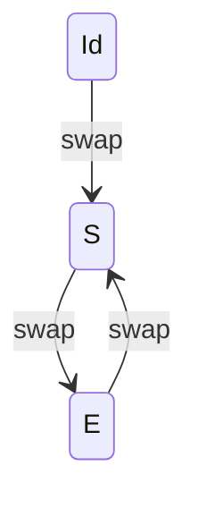

# Binding 与单调效果的联合代数

在固定的 Add 位置、正向事实插入和 union 模型下，自动枚举出三个联合状态：Id、S、E。E=S²，包含已经补齐的交换效果，因此不是空操作。

| 状态 | 当前选择 | 新增节点 | 新增等价 |
|---|---|---|---|
| Id | Add(a,b) | 无 | 无 |
| S | Add(b,a) | Add(b,a) | Add(a,b) ≡ Add(b,a) |
| E | Add(a,b) | Add(b,a) | Add(a,b) ≡ Add(b,a) |

## 组合表

行操作先执行，列操作后执行。

| ; | Id | S | E |
|---|---|---|---|
| Id | Id | S | E |
| S | S | E | S |
| E | E | S | E |

该有限表满足结合律（全部 27 个三元组合已核对）。它给出 Id、奇数次 S、正偶数次 E 的归纳递推；不是仅凭 0–8 次执行样本猜测。这个结论限定在实现的符号效果模型内，不是任意 egraph 程序的通用证明。

## 原生核对

| 操作 | Add 行数 | Step 行数 | Seen 行数 | 实际有更新的迭代数 |
|---|---:|---:|---:|---:|
| Id | 2 | 0 | 0 | 0 |
| left | 3 | 0 | 0 | 1 |
| left ; left | 3 | 0 | 0 | 1 |
| left ; left ; left | 3 | 0 | 0 | 1 |
| left ; left ; left ; left | 3 | 0 | 0 | 1 |
| left ; left ; left ; left ; left | 3 | 0 | 0 | 1 |
| left ; left ; left ; left ; left ; left | 3 | 0 | 0 | 1 |
| left ; left ; left ; left ; left ; left ; left | 3 | 0 | 0 | 1 |
| left ; left ; left ; left ; left ; left ; left ; left | 3 | 0 | 0 | 1 |
| left ; left ; right ; right | 4 | 0 | 0 | 2 |
| grow ; grow | 0 | 2 | 3 | 2 |
| grow ; grow ; grow ; grow | 0 | 4 | 5 | 4 |

原生起始图有两个独立 Add，所有步骤后逐项核对事实、表行数和等价划分。当前选择由实验的显式焦点描述记录，不将其与 e-class ID 混同。

## 两个位置与边界

两个独立位置共有 9 个联合状态。长度不超过 4 的全部 31 种左右序列均与原生结果一致。

- 同一位置：S³=S、S⁴=S²、E²=E。
- 仅观察图事实：S 与 E 相同；保留当前选择时，它们不同。
- 左位置交换两次，再交换右位置两次，会多出右侧反向节点，不能吸收为仅左侧两次。
- Seen(x)→Seen(Step(x)) 持续产生新事实；两次和四次结果不同。
- 达到闭包枚举预算只表示尚未闭合，不表示发现不动点或证明发散。

这些等式不保留时间戳、provenance 事件数量或 match 次数；如果需要恢复历史，应另外保存重复次数。它们也不包括删除、I/O、自定义 merge 或未建模的交错规则。
