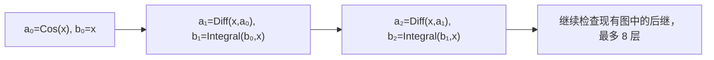

# 分部积分自组合的有限覆盖

单位：最终原图中去重后的 LHS∪RHS 节点；每列固定入口。

| 深度 | 固定 binding | 固定入口 e-class（2 个 binding） | 全部 LHS 入口对照 |
|---|---:|---:|---:|
| 1 | 8 | 15 | 118988 |
| 2 | 14 | 27 | 118988 |
| 4 | 26 | 51 | 118988 |
| 8 | 50 | 99 | 118988 |

固定入口 e-class 的新增覆盖（相对上一行）：15, 12, 24, 48。

只通过查询查找后继；缺少 RHS 或 union 等价关系时停止，不生成任何假想节点。
